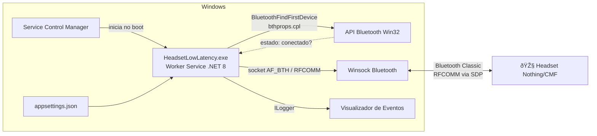

# 🎧 Headset Low Latency Keeper

Serviço do Windows que **liga automaticamente o modo de baixa latência** de headsets Nothing / CMF
toda vez que eles conectam ao PC.

Sem ele, toda vez que o headset é desligado e ligado (ou reconecta), o modo de baixa latência volta
para o padrão e é preciso abrir o [ear (web)](https://earweb.bttl.xyz/) para ligar de novo na mão.
Este serviço fala diretamente com o headset pelo mesmo protocolo que o ear (web) usa.

> Testado com o **CMF Headphone Pro** (codinome `forretress`). Outros modelos Nothing/CMF que
> suportam baixa latência no ear (web) usam o mesmo comando e devem funcionar.

---

## Sumário

- [Como funciona](#como-funciona)
- [Arquitetura](#arquitetura)
- [Fluxo do serviço](#fluxo-do-serviço)
- [Protocolo](#protocolo)
- [Requisitos](#requisitos)
- [Instalação](#instalação)
- [Configuração](#configuração)
- [Logs](#logs)
- [Desinstalação](#desinstalação)
- [Solução de problemas](#solução-de-problemas)
- [Estrutura do projeto](#estrutura-do-projeto)
- [Créditos](#créditos)

---

## Como funciona

1. A cada poucos segundos o serviço consulta a API Bluetooth do Windows (`bthprops.cpl`) para saber se o
   headset pareado está **conectado**. Essa consulta não faz busca por dispositivos e não acorda o headset.
2. Quando o headset conecta, o serviço espera alguns segundos e abre um socket **RFCOMM** pelo UUID do
   serviço de controle da Nothing. O Windows resolve o canal via SDP.
3. Ele **lê** o estado atual da latência. Se estiver desligada, envia o comando para **ligar** e lê de
   novo para confirmar.
4. Enquanto o headset fica conectado, ele revalida periodicamente (padrão: a cada 5 min).
5. Quando o headset desconecta e reconecta, o ciclo recomeça.

O socket de controle é fechado logo depois de cada operação, então não fica preso ao headset.

## Arquitetura



## Fluxo do serviço

### Loop principal

```mermaid
flowchart TD
    A([Início do serviço]) --> B[Procurar headset pareado<br/>por nome ou MAC]
    B --> C{Conectado?}
    C -- Não --> D{Estava conectado<br/>antes?}
    D -- Sim --> E[Log: desconectado]
    D -- Não --> W
    E --> W
    C -- Sim --> F{Acabou de<br/>conectar?}
    F -- Sim --> G[Esperar ConnectDelaySeconds]
    G --> H[Garantir baixa latência]
    F -- Não --> I{Hora da<br/>revalidação?}
    I -- Sim --> H
    I -- Não --> W
    H --> J{Sucesso?}
    J -- Sim --> K[Próxima verificação em<br/>RecheckMinutes]
    J -- Não --> L[Tentar de novo em 15s]
    K --> W
    L --> W
    W[Esperar PollSeconds] --> B
```



### Garantir baixa latência

```mermaid
flowchart TD
    A([Abrir RFCOMM<br/>UUID aeac4a03-...]) --> B[Enviar leitura 0xC041]
    B --> C{Resposta 0x4041<br/>byte 8}
    C -- 1 = ligado --> D([Já está ligado ✔])
    C -- 2 = desligado / sem resposta --> E[Enviar 0xF040<br/>payload 01 00]
    E --> F[Aguardar 400 ms]
    F --> G[Enviar leitura 0xC041]
    G --> H{Resposta}
    H -- 1 --> I([Ligado com sucesso ✔])
    H -- sem resposta --> J([Enviado, sem confirmação])
    H -- 2 --> K([Erro → nova tentativa em 15s])
```



### Conversa com o headset

```mermaid
sequenceDiagram
    participant S as Serviço
    participant W as Winsock (AF_BTH)
    participant H as Headset

    S->>W: connect(MAC, UUID do serviço)
    W->>H: Consulta SDP → canal RFCOMM
    W->>H: Abre canal RFCOMM
    S->>H: 55 60 01 41 C0 00 00 01 25 10 (ler latência)
    H-->>S: 55 .. 41 40 .. [02] .. (desligada)
    S->>H: 55 60 01 40 F0 02 00 02 01 00 <crc> (ligar)
    S->>H: 55 60 01 41 C0 00 00 03 <crc> (ler latência)
    H-->>S: 55 .. 41 40 .. [01] .. (ligada)
    S->>W: close()
```



## Protocolo

Os headsets Nothing/CMF expõem um serviço **RFCOMM** proprietário:

| Item | Valor |
|---|---|
| UUID do serviço | `aeac4a03-dff5-498f-843a-34487cf133eb` |
| Transporte | Bluetooth Classic, RFCOMM (canal resolvido via SDP) |

Formato de frame:

```
 0    1    2    3        4        5     6    7      8 ... n     n+1     n+2
[55] [60] [01] [cmd lo] [cmd hi] [len] [00] [opId] [payload] [crc lo] [crc hi]
```

- `cmd`: comando de 16 bits, little-endian
- `len`: tamanho do payload
- `opId`: contador de operação (1 byte, incrementa a cada envio)
- `crc`: CRC-16/MODBUS (poly `0xA001`, init `0xFFFF`) sobre header + payload

Comandos usados:

| Comando | Código | Payload | Descrição |
|---|---|---|---|
| Ler latência | `0xC041` | (vazio) | Pede o estado atual |
| Resposta latência | `0x4041` | byte 8: `1` ligado, `2` desligado | Enviado pelo headset |
| Definir latência | `0xF040` | `01 00` ligar / `02 00` desligar | Altera o modo |

Exemplos de frames (opId = 1):

```
Ligar baixa latência: 55 60 01 40 F0 02 00 01 01 00 76 3C
Ler latência:         55 60 01 41 C0 00 00 01 25 10
```

## Requisitos

| Dependência | Para quê | Como instalar |
|---|---|---|
| Windows 10 ou 11 | API Bluetooth Win32 + Winsock AF_BTH | — |
| Headset já **pareado** no Windows | O serviço não faz pareamento | Configurações → Bluetooth |
| .NET 8 SDK | Compilar o projeto | `winget install Microsoft.DotNet.SDK.8` |
| Acesso ao nuget.org | Baixar os pacotes abaixo no build | já configurado via `src/nuget.config` |

Pacotes NuGet:

- `Microsoft.Extensions.Hosting` 8.0.1: host genérico, DI, configuração, logging
- `Microsoft.Extensions.Hosting.WindowsServices` 8.0.1: integração com o SCM e com o Event Log

> O SDK só é necessário para compilar. Depois de instalado, o serviço roda só com o **.NET 8 Runtime**.

## Instalação

### 1. Clonar

```powershell
git clone https://github.com/leorr/headset-low-latency.git
cd headset-low-latency
```

> Se baixou como `.zip`, desbloqueie os arquivos antes, porque o Windows bloqueia scripts vindos da internet:
> ```powershell
> Get-ChildItem -Recurse | Unblock-File
> ```

### 2. Testar no console (recomendado)

```powershell
cd src
dotnet run -- --list   # lista os dispositivos pareados; confira o nome/MAC do headset
dotnet run             # roda no console; desligue e ligue o headset e acompanhe o log
```

Saída esperada:

```
info: HeadsetLowLatency.Worker[0] Monitorando headset 'Headphone Pro'
info: HeadsetLowLatency.Worker[0] Headset conectado: CMF Headphone Pro (AA:BB:CC:DD:EE:FF)
info: HeadsetLowLatency.Worker[0] Baixa latência LIGADA com sucesso.
```

> Feche o ear (web) durante o teste, porque só um app consegue usar o canal de controle por vez.

### 3. Instalar como serviço

Clique com o botão direito em `install.ps1` → **Run with PowerShell** e aceite o UAC.

Ou, num terminal na pasta do projeto:

```powershell
powershell -ExecutionPolicy Bypass -File .\install.ps1
```

O script:

1. Pede elevação de administrador sozinho (UAC)
2. Para e remove uma versão anterior do serviço, se existir
3. Compila e publica em `C:\Program Files\HeadsetLowLatency`
4. Cria o serviço `HeadsetLowLatency` com início **automático**
5. Configura reinício automático em caso de falha
6. Inicia o serviço

```mermaid
flowchart LR
    A[install.ps1] --> B{É admin?}
    B -- Não --> C[Reabre elevado via UAC] --> A
    B -- Sim --> D[Remove serviço antigo]
    D --> E[dotnet publish]
    E --> F[New-Service<br/>StartupType Automatic]
    F --> G[sc failure → restart]
    G --> H[Start-Service ✔]
```



## Configuração

Arquivo: `C:\Program Files\HeadsetLowLatency\appsettings.json`

```json
{
  "Headset": {
    "DeviceName": "Headphone Pro",
    "DeviceAddress": "",
    "PollSeconds": 3,
    "ConnectDelaySeconds": 3,
    "RecheckMinutes": 5
  }
}
```

| Chave | Padrão | Descrição |
|---|---|---|
| `DeviceName` | `Headphone Pro` | Trecho do nome do headset como aparece no Windows (sem diferenciar maiúsculas) |
| `DeviceAddress` | vazio | MAC no formato `AA:BB:CC:DD:EE:FF`. Se preenchido, tem prioridade sobre o nome |
| `PollSeconds` | `3` | Intervalo entre as verificações de conexão |
| `ConnectDelaySeconds` | `3` | Espera após conectar antes de mandar o comando |
| `RecheckMinutes` | `5` | Revalidação periódica enquanto conectado (`0` desativa) |

Depois de editar, reinicie o serviço:

```powershell
Restart-Service HeadsetLowLatency
```

## Logs

**Visualizador de Eventos** → Logs do Windows → **Aplicativo** → fonte `HeadsetLowLatency`

Ou pelo PowerShell:

```powershell
Get-EventLog -LogName Application -Source HeadsetLowLatency -Newest 20
```

## Desinstalação

Botão direito em `uninstall.ps1` → **Run with PowerShell**, ou:

```powershell
powershell -ExecutionPolicy Bypass -File .\uninstall.ps1
```

## Solução de problemas

| Sintoma | Causa | Solução |
|---|---|---|
| `install.ps1 is not digitally signed` | Arquivos marcados como baixados da internet | `Get-ChildItem -Recurse \| Unblock-File` |
| `No .NET SDKs were found` | Só o runtime está instalado | `winget install Microsoft.DotNet.SDK.8` e abrir um terminal **novo** |
| `NU1100: Unable to resolve 'Microsoft.Extensions.Hosting'` | NuGet sem fonte de pacotes | Já resolvido pelo `src/nuget.config`; ou `dotnet nuget add source https://api.nuget.org/v3/index.json -n nuget.org` |
| Log não mostra "Headset conectado" | Nome não bate | Rode `dotnet run -- --list` e ajuste `DeviceName` ou `DeviceAddress` |
| `Falha ao aplicar baixa latência` repetido | Outro app (ear (web), Nothing X) usando o canal | Feche o outro app |
| Latência volta a desligar sem reconectar | Firmware mudou o modo sozinho | Diminua `RecheckMinutes` |

## Estrutura do projeto

```
.
├── install.ps1              # compila, instala e inicia o serviço (auto-eleva)
├── uninstall.ps1            # para e remove o serviço
├── publish.ps1              # cria o repositório no GitHub e faz o push
├── README.md
└── src/
    ├── HeadsetLowLatency.csproj
    ├── nuget.config         # fonte nuget.org explícita
    ├── appsettings.json     # configuração do serviço
    ├── Program.cs           # host + modo --list
    ├── KeeperOptions.cs     # opções de configuração
    ├── Worker.cs            # loop de monitoramento e lógica de baixa latência
    ├── BluetoothNative.cs   # P/Invoke bthprops.cpl + endpoint RFCOMM (SOCKADDR_BTH)
    └── NothingProtocol.cs   # montagem de frames, CRC-16 e parser de respostas
```

## Créditos

- Protocolo baseado no [ear (web)](https://github.com/radiance-project/ear-web) do radiance-project
- Vetores de teste conferidos com o [nothingctl](https://github.com/FormalSnake/nothingctl)

> Projeto não oficial. Não é afiliado à Nothing Technology Limited. Use por sua conta e risco.

